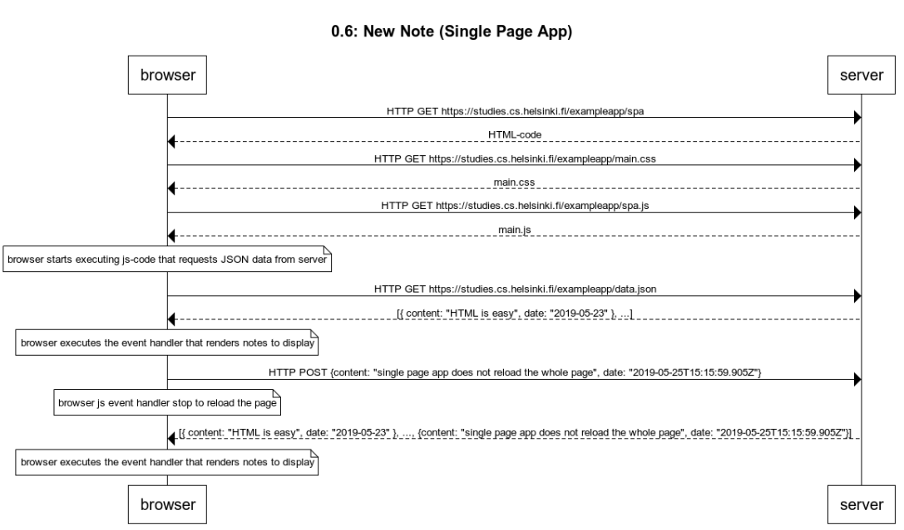

<h1> Title 0.6: New Note (Single Page App) </h1>

    browser->server: HTTP GET https://studies.cs.helsinki.fi/exampleapp/spa
    server-->browser: HTML-code
    browser->server: HTTP GET https://studies.cs.helsinki.fi/exampleapp/main.css
    server-->browser: main.css
    browser->server: HTTP GET https://studies.cs.helsinki.fi/exampleapp/spa.js
    server-->browser: main.js
    
    note over browser:
    browser starts executing js-code that requests JSON data from server 
    end note
    
    browser->server: HTTP GET https://studies.cs.helsinki.fi/exampleapp/data.json
    server-->browser: [{ content: "HTML is easy", date: "2019-05-23" }, ...]
    
    note over browser:
    browser executes the event handler that renders notes to display
    end note
    
    browser->server: HTTP POST {content: "single page app does not reload the whole page", date: "2019-05-25T15:15:59.905Z"}
    note over browser: browser js event handler stop to reload the page
    
    server-->browser: [{ content: "HTML is easy", date: "2019-05-23" }, ..., {content: "single page app does not reload the whole page", date: "2019-05-25T15:15:59.905Z"}]
    note over browser: browser executes the event handler that renders notes to display

